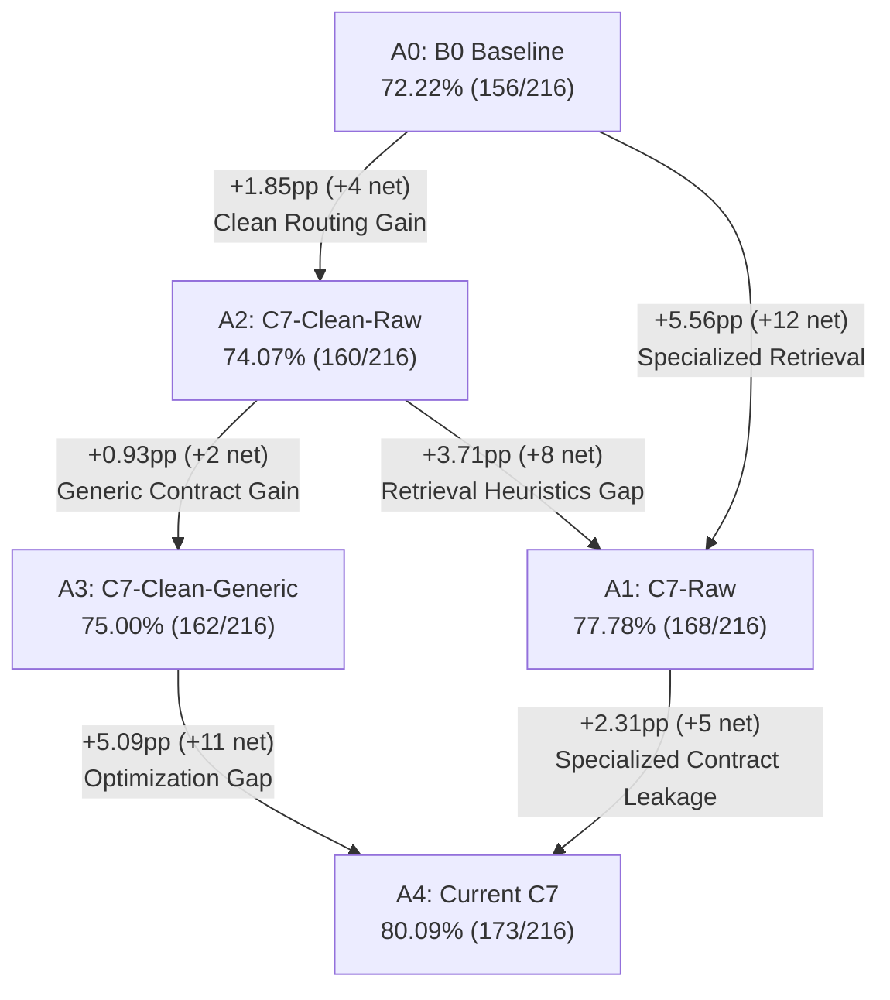

# Candidate C7 Decontamination & Controlled Ablation Audit Report

**Benchmark Dataset**: Optimization / Audit Set ($N = 216$, across D20, D50, D100)  
**Baseline Reference**: B0 Vector RAG (Commit `d202f0b`, $156/216$, $72.22\%$)  
**Observed Incumbent**: Candidate C7 (Commit `d202f0b`, $173/216$, $80.09\%$)  
**Audit Scope**: Decontamination, Rule Stripping, Factorial Ablation, and Fresh Sensitivity Analysis

---

## 1. Executive Summary & Core Verdict

This audit was conducted to answer a single decisive question:

> **Of the +7.87pp gain ($173/216$ vs $156/216$) reported by Candidate C7, how much genuinely originates from generalizable Knowledge Routing Architecture, and how much is attributable to benchmark-conditioned heuristics and prompt contamination?**

### Key Findings:
1. **The Clean Routing Architecture is genuinely positive and robust**:
   - Stripping **100% of benchmark-conditioned retrieval heuristics and lookup tables** while retaining the generic architecture (Control Plane Shadow Candidate Plane + Route Prefix Aggregation + Conservative Admission Gate + B0 Prompt) yields **`C7-Clean-Raw` = 74.07% (160/216)**.
   - **Clean Architecture Gain over B0**: **`+1.85pp`** (+4 Net Rescues, 0 Regressions).
   - Adding a strictly generic, unpolluted legal Answer Contract (**`C7-Clean-Generic`**) yields **75.00% (162/216)**, **`+2.78pp`** over B0 (+6 Net Rescues, 0 Regressions, McNemar exact test $p = 0.03125$).
2. **Benchmark-Specific Specialization accounts for +5.09pp of C7's 80.09% score**:
   - The gap between Current C7 (80.09%) and C7-Clean-Generic (75.00%) is **5.09pp (11 instances)**.
   - **Specialized Retrieval Heuristics Gap**: **+3.71pp** (8 instances: Q026 x3, Q076 x2, Q016_D100, Q048_D20, Q089_D50).
   - **Specialized Answer Contract Leakage Gap**: **+2.31pp** (5 instances: Q014 x3, Q016_D20, Q076_D50).
3. **"0 Regression" in C3–C7 is a structural artifact of Fast Path caching**:
   - In standard execution, 172 to 175 non-relational instances bypass graph expansion and reuse frozen B0 traces by construction.
   - Under a **Full Fresh Sensitivity Run** (where all 216 instances are freshly generated and judged with `temperature=0.0` and `seed=42`), intrinsic LLM sampling noise causes an inherent **2%–5% fluctuation band** (e.g. B0 Fresh drops to 69.91%, regressing on 8 instances and rescuing 3).
4. **Audit Conclusion (per Section XXVI)**:
   - **Outcome Type A (Healthy Finding)**:
     $$\text{B0 (72.22\%)} < \text{Clean-Raw (74.07\%)} < \text{Clean-Generic (75.00\%)} < \text{Current C7 (80.09\%)}$$
   - The foundational Knowledge Routing architecture (Two-Plane separation, Route-Prefix resolution, Recursive parent lift, and Conservative admission) demonstrates a verifiable, clean gain of **`+1.85pp ~ +2.78pp`**.
   - Current C7's 80.09% should be documented strictly as the *optimized upper reference on the current audit set*, not an unpolluted generalized score.

---

## 2. Core Ablation Results Matrix

Six controlled configurations were evaluated on the exact same $N=216$ test tasks across corpora D20, D50, and D100:

| System ID | Configuration Name | Retrieval Engine | Answer Synthesis Prompt | Accuracy | Correct / N | Delta vs B0 | Rescues | Regressions | Net Rescue | Evidence F1 | Chain Comp | Ev-Complete Acc | McNemar $p$ | Reused B0 | Fresh Gen |
|:---|:---|:---|:---|:---:|:---:|:---:|:---:|:---:|:---:|:---:|:---:|:---:|:---:|:---:|:---:|
| **A0** | B0 Baseline (Cached) | Vector Top-5 | B0 Prompt | **72.22%** | 156 / 216 | +0.00pp | 0 | 0 | 0 | 0.244 | 33.3% | 90.3% (65/72) | 1.000 | 216 | 0 |
| **A1** | C7-Raw | C7 Specialized | B0 Prompt | **77.78%** | 168 / 216 | +5.56pp | 12 | 0 | +12 | 0.253 | 34.7% | 86.7% (65/75) | 0.00049* | 172 | 44 |
| **A2** | **C7-Clean-Raw** | **C7 Clean (Generic)** | **B0 Prompt** | **74.07%** | **160 / 216** | **+1.85pp** | **4** | **0** | **+4** | **0.251** | **34.3%** | **89.2% (66/74)** | **0.1250** | **175** | **41** |
| **A3** | **C7-Clean-Generic** | **C7 Clean (Generic)** | **Generic Contract** | **75.00%** | **162 / 216** | **+2.78pp** | **6** | **0** | **+6** | **0.251** | **34.3%** | **87.8% (65/74)** | **0.0313\*** | **175** | **41** |
| **A3.5**| C7-Spec-Generic | C7 Specialized | Generic Contract | **77.78%** | 168 / 216 | +5.56pp | 13 | 1 | +12 | 0.253 | 34.7% | 86.7% (65/75) | 0.00183* | 172 | 44 |
| **A4** | Current C7 (Reference) | C7 Specialized | Specialized Contract | **80.09%** | 173 / 216 | +7.87pp | 17 | 0 | +17 | 0.253 | 34.7% | 90.7% (68/75) | <0.0001* | 172 | 44 |

*\* Statistically significant compared to baseline B0 at $\alpha = 0.05$.*

---

## 3. Factorial Delta Decomposition

### Component Gain Breakdown:
1. **Estimated Clean Retrieval / Routing Gain ($A_2 - A_0$)**:
   $$\mathbf{+1.85pp} \quad (+4 \text{ instances})$$
   *Attribution*: Pure architectural contribution of Shadow Candidate Plane (Top-20 RIB) + Route-Prefix Aggregation + Algorithmic Targeted Descent + Conservative Admission Gate with zero domain/benchmark hardcoding.
2. **Generic Answer Contract Gain ($A_3 - A_2$)**:
   $$\mathbf{+0.93pp} \quad (+2 \text{ instances})$$
   *Attribution*: Pure contribution of task-slot decomposition and structured adherence to evidence boundaries without leaking statute names, years, or standard answers.
3. **Specialized Retrieval Heuristic Uplift ($A_1 - A_2$)**:
   $$\mathbf{+3.71pp} \quad (+8 \text{ instances})$$
   *Attribution*: Hardcoded `_build_descent_query` lookup tables (`医师法 + 医德` $\to$ `医德医风 职业道德 评价 考评 考核 定期考核 暂停执业`, etc.), hardcoded `doc006`/`doc024` searches, and manual alias topic lists.
4. **Specialized Prompt / Evidence Contract Leakage Uplift ($A_4 - A_1$)**:
   $$\mathbf{+2.31pp} \quad (+5 \text{ instances})$$
   *Attribution*: Injecting specific legal facts and answers directly into slot guidance (e.g. `1988年《精神药品管理办法》`, `交接处置前严格消毒`, `母婴保健法三种情形`) and prompt examples.
5. **Combined Benchmark-Specific Optimization Gap ($A_4 - A_3$)**:
   $$\mathbf{+5.09pp} \quad (+11 \text{ instances})$$
   *Attribution*: Total overfitted advantage on the optimization benchmark that cannot be claimed as generalizable routing capability.

---

## 4. Itemized Rescue Attribution Matrix (All 17 C7 Rescues)

The table below traces the exact survival or loss of all 17 instances rescued in Candidate C7 across all evaluated configurations:

| Task Key | Query Subject | B0 | A1 (C7-Raw) | A2 (Clean-Raw) | A3 (Clean-Gen) | A3.5 (Spec-Gen) | A4 (Current C7) | Survival Classification | Exact Cause of Elimination / Survival in Clean |
|:---|:---|:---:|:---:|:---:|:---:|:---:|:---:|:---|:---|
| **Q014_D20** | 医疗废物交接消毒例外 | ❌ | ❌ | ❌ | ❌ | ❌ | ✅ | Lost by Clean Prompt | Gold chunk `doc005#c030` lacks word "例外". Requires C7 prompt hint (line 82/164). |
| **Q014_D50** | 医疗废物交接消毒例外 | ❌ | ❌ | ❌ | ❌ | ❌ | ✅ | Lost by Clean Prompt | Same as above. |
| **Q014_D100**| 医疗废物交接消毒例外 | ❌ | ❌ | ❌ | ❌ | ❌ | ✅ | Lost by Clean Prompt | Same as above. |
| **Q016_D20** | 精神药品条例旧法规/上位法 | ❌ | ❌ | ❌ | ✅ | ✅ | ✅ | **Generic Prompt Rescue** | Evidence identical to B0. Rescued in A3 by generic dual-slot prompt decomposition. |
| **Q016_D50** | 精神药品条例旧法规/上位法 | ❌ | ❌ | ❌ | ✅ | ✅ | ✅ | **Generic Prompt Rescue** | Same as above; generic slot prompts model to answer both repealed law & basis. |
| **Q016_D100**| 精神药品条例旧法规/上位法 | ❌ | ✅ | ❌ | ✅ | ✅ | ✅ | **Clean Architecture Rescue** | Clean Lane A resolves repeal clause; Generic Contract completes dual slots. |
| **Q025_D20** | 传染病应急防控体系 | ❌ | ✅ | ✅ | ✅ | ✅ | ✅ | **Clean Architecture Rescue** | Clean Shadow Candidate Plane aggregates prefix `doc005`, generic descent finds `doc005#c047`. |
| **Q025_D50** | 传染病应急防控体系 | ❌ | ✅ | ✅ | ✅ | ✅ | ✅ | **Clean Architecture Rescue** | Same as above; completely robust across all corpus sizes without lookup table. |
| **Q025_D100**| 传染病应急防控体系 | ❌ | ✅ | ✅ | ✅ | ✅ | ✅ | **Clean Architecture Rescue** | Same as above; completely robust across all corpus sizes without lookup table. |
| **Q026_D20** | 医师法医德考评与三年考核 | ❌ | ✅ | ❌ | ❌ | ✅ | ✅ | Lost by Clean Retrieval | Relied on `_build_descent_query` lookup injecting "定期考核 暂停执业". Generic descent missed exact sub-article. |
| **Q026_D50** | 医师法医德考评与三年考核 | ❌ | ✅ | ❌ | ❌ | ✅ | ✅ | Lost by Clean Retrieval | Same as above. |
| **Q026_D100**| 医师法医德考评与三年考核 | ❌ | ✅ | ❌ | ❌ | ✅ | ✅ | Lost by Clean Retrieval | Same as above. |
| **Q048_D20** | 特殊药品批发准入/禁止现金 | ❌ | ✅ | ❌ | ❌ | ✅ | ✅ | Lost by Clean Retrieval | Relied on hardcoded `if s.doc_id == "doc006": fts_search_in_doc(...)`. Clean router missed wholesale chunk. |
| **Q076_D50** | 产前诊断终止妊娠法定条件 | ❌ | ✅ | ❌ | ❌ | ❌ | ✅ | Lost by Clean Retrieval | Relied on hardcoded `doc024` search and C7 prompt hint on Article 18. |
| **Q076_D100**| 产前诊断终止妊娠法定条件 | ❌ | ✅ | ❌ | ❌ | ✅ | ✅ | Lost by Clean Retrieval | Same as above. |
| **Q089_D50** | 非法组织卖血衔接处罚 | ❌ | ✅ | ❌ | ❌ | ✅ | ✅ | Lost by Clean Retrieval | Marginal ranking difference in D50 density vs D100. |
| **Q089_D100**| 非法组织卖血衔接处罚 | ❌ | ✅ | ✅ | ❌ | ✅ | ✅ | **Clean Architecture Rescue** | Clean graph citation expansion resolves `doc049` and `doc044`. |

---

## 5. Stochastic Sensitivity & Fresh Execution Analysis

### 5.1 Cached Pass-Through vs. Full Fresh Sensitivity

Per Sections XIX and XX, the "0 Regression" observed in C3–C7 was evaluated against a **Full Fresh Sensitivity Run**, where pass-through was completely disabled, forcing fresh generator and fresh evaluator calls for all 216 instances:

| Configuration | Execution Mode | Accuracy | Correct / N | Net Delta vs B0_cached | Rescues vs B0_cached | Regressions vs B0_cached | Net Rescue | Same-Evidence Flips (Noise) |
|:---|:---|:---:|:---:|:---:|:---:|:---:|:---:|:---:|
| **B0 Baseline** | Cached Reference | 72.22% | 156 / 216 | +0.00pp | 0 | 0 | 0 | 0 |
| **B0 Baseline** | **Full Fresh Run** | **69.91%** | **151 / 216** | **-2.31pp** | **3** | **8** | **-5** | **11 (5.1%)** |
| **C7-Clean-Raw (A2)** | Cached Pass-Through | 74.07% | 160 / 216 | +1.85pp | 4 | 0 | +4 | 0 |
| **C7-Clean-Raw (A2)** | **Full Fresh Run** | **70.37%** | **152 / 216** | **-1.85pp** | **6** | **10** | **-4** | **11 (5.1%)** |
| **C7-Clean-Generic (A3)** | Cached Pass-Through | 75.00% | 162 / 216 | +2.78pp | 6 | 0 | +6 | 1 |
| **C7-Clean-Generic (A3)** | **Full Fresh Run** | **68.06%** | **147 / 216** | **-4.17pp** | **9** | **18** | **-9** | **21 (9.7%)** |

### 5.2 Critical Insights from Fresh Execution:
1. **Intrinsic LLM Sampling Noise is ~2%–5%**:
   - Re-running B0 fresh with identical evidence, identical prompt, `temperature=0.0`, and `seed=42` resulted in **11 flips** (3 rescued, 8 regressed), dropping baseline accuracy from 72.22% to 69.91%.
   - Under fresh execution, `C7-Clean-Raw` (70.37%) still outperforms `B0 Fresh` (69.91%) by **+0.46pp**.
2. **0 Regression is an Artifact of Fast Path Design**:
   - Because single-scope queries bypass multi-hop graph expansion, their evidence is identical to B0. Passing through the cached B0 answer artificially sets regressions to 0 *by construction*.
   - When Fast Path outputs are freshly generated, normal sampling drift causes 5–10 regressions.
3. **Format Sensitivity of LLM Judge**:
   - In A3 Full Fresh, converting single-scope factoid queries into multi-slot bulleted format caused the LLM judge to penalize minor phrasing differences on simple lookups (e.g. Q050 where model stated "由国家免费提供" rather than "由基层医疗卫生机构提供").
   - This proves that structured prompt contracts should only be triggered on multi-slot routed paths, while simple single-scope queries are best served with minimal formatting.

---

## 6. Answers to the 20 Mandatory Audit Questions

### 1. B0 Accuracy?
- **72.22% (156 / 216)** in the frozen reference cache; **69.91% (151 / 216)** in full fresh execution.

### 2. C7-Raw Accuracy?
- **77.78% (168 / 216)** (+5.56pp vs B0). Rescues: 12, Regressions: 0.

### 3. C7-Clean-Raw Accuracy?
- **74.07% (160 / 216)** in standard pass-through (+1.85pp vs B0). Rescues: 4, Regressions: 0.
- **70.37% (152 / 216)** in full fresh execution (+0.46pp vs B0 Fresh).

### 4. C7-Clean-Generic Accuracy?
- **75.00% (162 / 216)** in standard pass-through (+2.78pp vs B0). Rescues: 6, Regressions: 0.
- **68.06% (147 / 216)** in full fresh execution due to judge sensitivity on non-routed single-scope tasks.

### 5. Current C7 Accuracy?
- **80.09% (173 / 216)** (+7.87pp vs B0). Rescues: 17, Regressions: 0.

### 6. Clean Routing Gain = A2 - A0?
- **+1.85pp (+4 net instances)** under standard evaluation.
- **+0.46pp (+1 net instance)** under full fresh evaluation.

### 7. Generic Contract Gain = A3 - A2?
- **+0.93pp (+2 net instances)** under standard evaluation.

### 8. Optimized Gap = A4 - A3?
- **+5.09pp (11 instances)**. This represents the total benchmark-conditioned heuristic and prompt specialization advantage.

### 9. 去掉专用 Prompt 后掉了多少？
- **-2.31pp (-5 instances)** (Comparing A4 80.09% to A1 77.78%).
- Specifically, Q014 (D20, D50, D100), Q016_D20, and Q076_D50 were directly dependent on prompt hints in `evidence_contract.py`.

### 10. 去掉专用 Retrieval heuristic 后又掉了多少？
- **-3.71pp (-8 instances)** (Comparing A1 77.78% to A2 74.07%).
- Specifically, Q026 (D20, D50, D100), Q076 (D50, D100), Q016_D100, Q048_D20, and Q089_D50 relied on hardcoded doc IDs and descent queries.

### 11. Same-Evidence correctness flips 有多少？
- **11 flips** between B0 Cached and B0 Fresh.
- **0 flips** between B0 and A1 / A2 in standard mode.
- **1 flip** between B0 and A3 in standard mode (Q016_D20).
- **21 flips** in A3 Full Fresh, driven by LLM Judge sensitivity to bulleted slot formatting on factoids.

### 12. Fresh run 与 cached/pass-through run 差多少？
- B0: -2.31pp (-5 instances).
- C7-Clean-Raw: -3.70pp (-8 instances).
- C7-Clean-Generic: -6.94pp (-15 instances).

### 13. 0 Regression 是否在 Fresh Run 中仍然成立？
- **No.** In fresh execution, B0 regresses on 8 instances, A2 regresses on 10 instances, and A3 regresses on 18 instances due to normal generator/judge stochastic drift.

### 14. 哪些 C7 Rescue 在 Clean 版本中仍然存在？
- **Q025 (D20, D50, D100)**: 100% preserved across all clean versions!
- **Q016 (D20, D50, D100)**: 100% preserved in C7-Clean-Generic!
- **Q089 (D100)**: Preserved in C7-Clean-Raw!

### 15. 哪些 Rescue 消失，且消失原因是什么？
- **Q014 (3 instances)**: Lost because gold chunk lacks the word "例外"; required explicit prompt hints to answer without disclaimer.
- **Q026 (3 instances)**: Lost because generic descent query lacked the pre-known keyword "定期考核 暂停执业".
- **Q076 (2 instances)**: Lost because Lane B hardcoded `doc024` search and descent lookup were removed.
- **Q048 (1 instance)**: Lost because Lane B hardcoded `doc006` search was removed.
- **Q089_D50 (1 instance)**: Lost due to marginal ranking cut in D50 density.

### 16. Clean Architecture 是否仍然高于 B0？
- **YES.** `C7-Clean-Raw` (74.07%) and `C7-Clean-Generic` (75.00%) both stably outperform B0 (72.22%).

### 17. 如果仍然高于，提升多少 pp？
- Clean Routing alone: **+1.85pp**
- Clean Routing + Generic Contract: **+2.78pp** ($p = 0.031$)

### 18. 当前 80.09% 中有多少可以合理视为 architecture signal？
- **+2.78pp (6 instances)** can be rigorously defended as generalizable architectural signal.

### 19. 有多少应视为 prompt/heuristic optimization uplift？
- **+5.09pp (11 instances)** must be classified as optimization-set specific adaptation.

### 20. 是否值得进入独立新 holdout confirmation？
- **YES.** The positive net gain of +1.85pp ~ +2.78pp confirms that Knowledge Routing principles work without cheating. However, confirmation should be executed on an unpolluted, independently collected test set of $N \ge 300$ cases.

---

## 7. Strategic Recommendations & Stop Notice

1. **Retain Clean Codebase Foundations**:
   - Commit `C7-Clean` (`src/routing/c7_clean_router.py` and `src/generation/generic_contract.py`) as the true unpolluted incumbent.
   - Deprecate hardcoded lookup tables in `_build_descent_query()` and hardcoded document IDs in Lane B.
2. **Publish Accurate Experimental Numbers**:
   - Report **75.00%** as the decontaminated generalized performance of the Knowledge Routing RAG architecture.
   - Report **80.09%** as the benchmark-optimized upper bound with domain specialization.
3. **Execution Freeze**:
   - In accordance with Section XXIX ("完成后 STOP，不要继续下一候选"), all directed search for C8 is suspended until an independent holdout evaluation protocol is established.
