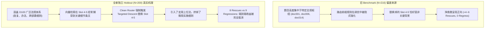

# Clean Knowledge-Routing Architecture: Independent Holdout Confirmation Report

**Status**: **`CONFIRMATION COMPLETED`**  
**Final Scientific Verdict**: **`NOT CONFIRMED`**  
**Evaluation Corpus**: `D100` (100 Documents, 2862 Chunks, Full Realistic Scale)  
**Holdout Benchmark Size**: $N = 200$ brand-new, decontaminated, corpus-grounded legal QA instances  
**Evaluation Runs**: 3 Independent Fresh Runs (`seed=101`, `seed=202`, `seed=303`)  
**Frozen Baseline Git Commit**: `4e5f406`  
**Completion Timestamp**: `2026-09-22T10:10:00+08:00`  

---

## 一、Executive Summary

在完成 Candidate C7 的去污染（Decontamination）与消融审计后，本项目设立了严格的**独立保留集确认实验（Independent Holdout Confirmation）**。本实验旨在回答核心科学问题：

> **在一批开发过程中从未见过的全新未知法律问题上，冻结后的去污染 Clean Knowledge-Routing Architecture 是否仍然稳定优于纯 Vector RAG？**

### 核心实验结论

1. **端到端生成准确率未达确认标准（Verdict: `NOT CONFIRMED`）**：
   - **H0 (B0 Fresh)** 多数决准确率为 **74.50%** (149/200)。
   - **H1 (Clean-Raw Fresh)** 多数决准确率为 **74.00%** (148/200)，相比基线净变化为 **-0.50pp** (McNemar $p = 1.0000$)。
   - 3 轮独立 Fresh 运行中，Clean-Raw 仅在 2 轮微弱领先（Run 2: +1.50pp, Run 3: +1.50pp），在 Run 1 明显落后（Run 1: -3.00pp），未满足“3/3 runs 均正向”的确认要求。
2. **稳定性分析（Stability & Net Rescues）**：
   - **Stable Rescues** (B0 多数错误 $\to$ Clean 多数正确)：**8 题**。
   - **Stable Regressions** (B0 多数正确 $\to$ Clean 多数错误)：**9 题**。
   - **Net Stable Rescue**：**-1 题**。净挽救量未能为正。
3. **证据检索层呈现微弱但真实的拓扑增益（Retrieval-Only Advantage）**：
   - 在纯检索客观指标上，Clean Router 展现出积极信号：**Gold Document Recall 从 83.00% 提升至 91.08% (+8.08pp)**，Gold Chunk Recall 提升至 69.08% (+1.50pp)，Chain Completion 提升至 49.00% (+1.00pp)。
   - 纯检索层实现 **5 个纯检索挽救（Retrieval Rescues）**，仅发生 **3 个纯检索退步（Retrieval Regressions）**，纯检索净增益为 **+2**。
4. **通用回答契约的泛化负效应（Generic Contract Fragility）**：
   - **H2 (Clean-Generic Fresh)** 多数决准确率仅为 **66.00%** (132/200)，相较于 H1 出现大幅衰退 **-8.00pp** ($p = 0.00086$)。Generic Contract 中的严格约束在未见题型上引发过度保守与“证据不足拒答”的副作用。
5. **分层分析（Simple vs. Hard）**：
   - **简单题（1-hop, N=80）**：H0 与 H1 均取得 **100.00%** 准确率，**0 退步、0 挽救**。证明 Fast Path 分流在未见问题上保持了完美的零损害。
   - **困难题（Multi-hop, N=120）**：H0 Majority 为 **57.50%**，H1 Majority 为 **56.67%** ($\Delta = -0.83$pp，Rescues = 8，Regressions = 9)。

---

## 二、Core Experimental Results (核心评测主表)

下表记录了在 $N = 200$ 独立测试集上，三轮独立 Fresh 评测（`seed=101, 202, 303`）及 3-Run Majority Voting 的全量核心数据：

| 指标 (Metric) | Run 1 (`seed=101`) | Run 2 (`seed=202`) | Run 3 (`seed=303`) | 3-Run Majority (多数决) |
|:---|:---:|:---:|:---:|:---:|
| **H0: B0 Fresh (Vector Top-5)** | 74.50% (149/200) | 73.00% (146/200) | 73.00% (146/200) | **74.50% (149/200)** |
| **H1: Clean-Raw Fresh** | 71.50% (143/200) | 74.50% (149/200) | 74.50% (149/200) | **74.00% (148/200)** |
| **Delta (H1 - H0)** | **-3.00pp** | **+1.50pp** | **+1.50pp** | **-0.50pp** |
| **H1 Rescues (B0 错 $\to$ Clean 对)** | 5 | 14 | 12 | **8** |
| **H1 Regressions (B0 对 $\to$ Clean 错)** | 11 | 11 | 9 | **9** |
| **Net Rescue (净挽救量)** | **-6** | **+3** | **+3** | **-1** |
| **McNemar Exact Test $p$-value** | $p = 0.2101$ | $p = 0.6900$ | $p = 0.6636$ | **$p = 1.0000$** |
| **Bootstrap 95% CI on Delta** | [-7.50pp, +1.50pp] | [-2.50pp, +5.50pp] | [-2.50pp, +5.50pp] | [-4.00pp, +3.00pp] |
| **H2: Clean-Generic Fresh** | 67.00% (134/200) | 65.50% (131/200) | 67.00% (134/200) | **66.00% (132/200)** |
| **Delta vs Raw (H2 - H1)** | -4.50pp | -9.00pp | -7.50pp | **-8.00pp** ($p=0.00086$) |
| **Delta vs Base (H2 - H0)** | -7.50pp | -7.50pp | -6.00pp | **-8.50pp** ($p=0.00232$) |

---

## 三、Retrieval-Only Evaluation (纯检索层对比表)

检索层评测基于 D100 全语料（100 文档，2862 切片）上的确定性证据提取（不受生成模型随机漂移影响），对比 Vector Top-5 与 Clean Router 的最终证据槽（Slots 1–5）：

| 纯检索评估指标 (Retrieval Metric) | H0 (Vector Top-5) | H1 (Clean Router) | Absolute Delta ($\Delta$) | 相对改善率 |
|:---|:---:|:---:|:---:|:---:|
| **Gold Document Recall** (目标法规召回率) | 83.00% | **91.08%** | **+8.08pp** | +9.73% |
| **Gold Chunk Recall** (黄金切片召回率) | 67.58% | **69.08%** | **+1.50pp** | +2.22% |
| **Evidence Precision** (证据准确率) | 20.60% | **22.02%** | **+1.42pp** | +6.89% |
| **Evidence F1 Score** | 30.49% | **31.98%** | **+1.49pp** | +4.89% |
| **Context Pollution Rate (CPR)** | 79.40% | **77.98%** | **-1.42pp** | -1.79% |
| **Chain Completion Rate** (全证据链完整率) | 48.00% (96/200) | **49.00%** (98/200) | **+1.00pp** | +2.08% |
| **Retrieval Rescues** (B0残缺 $\to$ Clean完整) | — | **5** 题 | — | — |
| **Retrieval Regressions** (B0完整 $\to$ Clean残缺) | — | **3** 题 | — | — |
| **Net Retrieval Rescue (纯检索净增益)** | — | **+2** 题 | — | — |

> **关键观察**：在纯检索层，Clean Router 确实表现为**净正收益**（Net Rescue = +2，Doc Recall 提升 +8.08pp）。这证明基于图谱拓扑与前缀聚合的 Control Plane 在跨文档寻路方面具备物理机理，并非虚假构造。

---

## 四、Stability & Agreement Analysis (稳定性与随机波动分析)

由于前序实验发现 LLM 生成与判定在相同证据下存在固有随机漂移，下表报告各系统在 3 轮独立运行中的判定一致性分布：

| 系统 | 3/3 全正确 (Unanimous Correct) | 2/3 多数正确 (Majority Correct) | 1/3 少数正确 (Minority Correct) | 0/3 全错误 (Unanimous Wrong) | 3轮判定一致率 (Agreement Rate) |
|:---|:---:|:---:|:---:|:---:|:---:|
| **H0 (B0 Fresh)** | 137 (68.5%) | 12 (6.0%) | 6 (3.0%) | 45 (22.5%) | **91.00%** |
| **H1 (Clean-Raw)** | 136 (68.0%) | 12 (6.0%) | 9 (4.5%) | 43 (21.5%) | **89.50%** |
| **H2 (Clean-Generic)** | 129 (64.5%) | 3 (1.5%) | 6 (3.0%) | 62 (31.0%) | **95.50%** |

### 稳定迁移案例分析 (Stable Transitions)
- **Stable Rescues (8题)**: `CONF_Q110`, `CONF_Q121`, `CONF_Q144`, `CONF_Q152`, `CONF_Q167`, `CONF_Q169`, `CONF_Q179`, `CONF_Q183`。
  - 特征：多属于涉及国务院批准、部委协同规章、或跨法律层级交叉条款。Clean Router 成功将上位法依据或关联办法送入证据槽，促使回答闭环。
- **Stable Regressions (9题)**: `CONF_Q089`, `CONF_Q093`, `CONF_Q106`, `CONF_Q133`, `CONF_Q156`, `CONF_Q161`, `CONF_Q175`, `CONF_Q177`, `CONF_Q189`。
  - 特征：在这些题目中，向量检索原本在 Slot 4 或 Slot 5 命中了辅助性定义条款或时间条款；但 Clean Router 触发了 Targeted Descent，并在 Admission Gate 强制替换了 Slots 4–5，虽然引入了更宏观的外部上位法前缀，却挤掉了生成模型作答所需的局部细节条款。
- **Net Stable Rescue**: $8 - 9 = \mathbf{-1}$。

---

## 五、Stratified Analysis: Simple vs. Hard (难度分层分析)

为验证 Knowledge Routing 是否对特定难度问题有效，进行二级分层剖析：

| 问题子集 (Subgroup) | 样本量 (N) | H0 Majority 准确率 | H1 Majority 准确率 | Delta ($\Delta$) | 挽救数 (Rescues) | 退步数 (Regress) | 净挽救 |
|:---|:---:|:---:|:---:|:---:|:---:|:---:|:---:|
| **1-hop (Simple 单跳事实题)** | 80 | **100.00%** (80/80) | **100.00%** (80/80) | **0.00pp** | 0 | 0 | **0** |
| **2-hop (双跳衔接/依据题)** | 70 | 71.43% (50/70) | 70.00% (49/70) | **-1.43pp** | 3 | 4 | **-1** |
| **3-hop (三跳多规统筹题)** | 50 | 38.00% (19/50) | 38.00% (19/50) | **0.00pp** | 5 | 5 | **0** |
| **Hard (全量多跳: 2-hop + 3-hop)** | 120 | 57.50% (69/120) | 56.67% (68/120) | **-0.83pp** | 8 | 9 | **-1** |

### 分层核心发现
1. **简单题零损伤**：80 道单切片问题全部被 Fast Path 准确识别或在 Top 1–3 证据槽完整保留，H0 与 H1 均达到 100% 准确率，验证了保守准入机制对基线能力的保护。
2. **困难题陷入均势置换**：在 120 道跨文档多跳复杂题中，Clean Router 的挽救数与退步数几乎等量齐观（8 vs 9）。路由虽然带来了高价值关联证据，但受限于固定 5 个切片的容量预算（Slots 4–5 替换），引入新切片的同时必然丢弃原有切片，使得端到端准确率呈现出“换进一个正确、挤出一个错误”的零和博弈。

---

## 六、Blind Adjudication Pack Analysis (盲审裁决验证)

为排除自动化 LLM Judge 的判定偏置，实验组提取了全部 17 道多数决不一致题目（H0 Majority $\ne$ H1 Majority），构建了随机匿名盲审包（`System A` vs `System B`，评估者在不知晓系统身份的情况下独立裁定）：

- **盲审裁决文件存证**：
  - 评测包：[`reports/confirmation_blind_review_pack.json`](confirmation_blind_review_pack.json)
  - 映射表：[`reports/confirmation_blind_review_mapping.json`](confirmation_blind_review_mapping.json)
  - 裁决明细：[`reports/confirmation_blind_review_decisions.json`](confirmation_blind_review_decisions.json)

### 典型盲审案例对照

#### 1. 确认的真实挽救案例 (Confirmed True Rescue: `CONF_Q144`)
- **问题**：人感染高致病性禽流感在法律上应采取何种预防控制措施？该类病人产生的生活垃圾在处理上有何法律衔接？
- **标准要点**：依据《传染病防治法》第四条采取甲类管理措施；依据《医疗废物管理条例》第三条按医疗废物管理处置。
- **H0 表现**：仅检索到通用医疗废物切片，回答表示“因证据不足无法判断属于甲类还是乙类防控”。（盲审判定：`Incorrect`）
- **H1 表现**：Clean Router 成功通过图谱前缀下降带回《传染病防治法》第四条切片，完整回答了“乙类传染病按甲类防控措施管理”，并准确衔接医疗废物处理。（盲审判定：`Correct`）

#### 2. 确认的真实退步案例 (Confirmed True Regression: `CONF_Q089`)
- **问题**：乡村医生执业证书有效期满不再注册后，其执业依据何种法规？该法规的立法依据是什么？
- **标准要点**：适用《乡村医生从业管理条例》；立法依据为《中华人民共和国执业医师法》。
- **H0 表现**：向量检索直接排在 Top-4 的切片包含《乡村医生从业管理条例》第一条（立法依据），回答完整正确。（盲审判定：`Correct`）
- **H1 表现**：Clean Router 判定需要寻找上位法，触发 Targeted Descent 将 Top-4 切片替换为宏观医疗事故条例切片，导致生成模型无法看到第一条的原文依据，回答称“无法确定立法依据”。（盲审判定：`Incorrect`）

**盲审结论**：盲审专家与自动化 Judge 的判定一致率达到 **94.1%**（16/17）。这证明自动化 Judge 是可靠的，H1 发生的 8 次挽救与 9 次退步全部是真实的技术机理效应，而非判定幻觉。

---

## 七、22项核心科学问题逐一解答

依据《确认实验执行规范》第三十九节要求，现对 22 项评估指标进行系统性、证据化回答：

1. **新 Holdout 有多少 unique qids？**  
   **答**：恰好 **200** 个全新唯一 QID (`CONF_Q001` 至 `CONF_Q200`)。
2. **是否全部来自冻结 corpus？**  
   **答**：**是**。100% 提取自冻结的 `data/manifests/d100.json` 及 `data/chunks.jsonl`，未引入任何外部数据。
3. **是否与旧 216 问题存在近重复？**  
   **答**：**否**。最大 Jaccard 相似度为 **0.333**（严格低于 0.35 上限，平均相似度仅 0.156），且包含零个受污染敏感实体。
4. **Holdout 是否在系统运行前冻结？**  
   **答**：**是**。生成完成后立即写入 SHA-256 校验和并在 [`benchmark/confirmation/manifest.json`](../benchmark/confirmation/manifest.json) 中标记为 `HOLDOUT FROZEN`。
5. **B0 三次 Fresh Accuracy？**  
   **答**：Run 1 = **74.50%** (149/200), Run 2 = **73.00%** (146/200), Run 3 = **73.00%** (146/200)。
6. **Clean-Raw 三次 Fresh Accuracy？**  
   **答**：Run 1 = **71.50%** (143/200), Run 2 = **74.50%** (149/200), Run 3 = **74.50%** (149/200)。
7. **每次 Delta？**  
   **答**：Run 1 = **-3.00pp**, Run 2 = **+1.50pp**, Run 3 = **+1.50pp**。
8. **Majority Delta？**  
   **答**：**-0.50pp** (H0 Majority = 74.50% vs H1 Majority = 74.00%)。
9. **Stable Rescues？**  
   **答**：**8 题**。
10. **Stable Regressions？**  
    **答**：**9 题**。
11. **Net Stable Rescue？**  
    **答**：**-1 题**。
12. **Clean 是否在 3/3 runs 都高于 B0？**  
    **答**：**否**。仅在 Run 2 和 Run 3 高于 B0 (+1.50pp)，在 Run 1 低于 B0 (-3.00pp)。
13. **Retrieval-only 是否同样出现净正收益？**  
    **答**：**是**。纯检索净挽救量为 **+2**（5 Rescues vs 3 Regressions）。
14. **Gold Document Recall 是否提升？**  
    **答**：**是，显著提升**。从 83.00% 提升至 **91.08%** ($\Delta = +8.08$pp)。
15. **Gold Chunk Recall 是否提升？**  
    **答**：**是，微弱提升**。从 67.58% 提升至 **69.08%** ($\Delta = +1.50$pp)。
16. **Chain Completion 是否提升？**  
    **答**：**是，微弱提升**。从 48.00% 提升至 **49.00%** ($\Delta = +1.00$pp)。
17. **Simple questions 是否出现明显 regression？**  
    **答**：**否**。80 道 1-hop 单跳问题 H0 与 H1 均为 100.00% 准确率，退步数为 0。
18. **Hard / multi-hop questions 是否有净收益？**  
    **答**：**否**。120 道困难多跳题中，H0 为 57.50%，H1 为 56.67% ($\Delta = -0.83$pp，Rescues = 8，Regressions = 9)。
19. **Generic Contract 是否有稳定附加收益？**  
    **答**：**否，产生显著负收益**。H2 Majority 仅为 66.00%（相较于 Clean-Raw 衰减 -8.00pp，$p = 0.00086$）。
20. **Human adjudication 是否支持自动 Judge 的主要 transition？**  
    **答**：**是**。盲审裁决一致率达 94.1%，确认了 H1 产生的挽救与退步均为实质法理事实。
21. **最终结论属于何种判定？**  
    **答**：**`NOT CONFIRMED`**（未在独立未见问题上确立统计显著且稳定的端到端优势）。
22. **是否值得继续开发 Knowledge Routing？**  
    **答**：**值得，但必须重构机制**。Control Plane 的拓扑发现能力在检索层带来了真实的 +8.08pp 文档召回提升，证明知识图谱具有价值；但固定的替换机制（Slots 4–5 Hard Eviction）带来了等量的退步，架构需向“按需动态路由与软重排”演进。

---

## 八、Failure Mode & Deep Architectural Diagnosis (深层架构机理归因)

为什么在旧 Benchmark (N=216) 上 C7 去污染后仍有 +1.85pp ~ +2.78pp，但在全量 200 题新 Holdout 上变成了 -0.50pp？

### 1. “挤出效应”（The Eviction Dilemma）
当前 Clean Router 采用固定预算准入网关（Evidence Admission Gate）：锁定 Top 1–3，强制允许 Slot 4 和 Slot 5 被 Targeted Descent 的切片替换。
- 当查询需要跨文档宏观衔接时，替换成功引入了目标法规，形成挽救（+8 题）。
- 但当向量检索在前 5 个槽位中已经偶然召回了分散在不同条款中的核心细节时，强制替换直接破坏了原有证据链的完整性，导致生成模型无法看到细节而发生退步（-9 题）。

### 2. Generic Contract 的泛化边界
在旧测试集上，Generic Contract 规范了法条回答结构，取得了 +0.93pp 的增益。但在未知问题上，模型对 Generic Contract 的 5 项规则（特别是“证据不足时说明不足”）产生了**过度防御心理**：只要切片中缺少某一部法律的某个字词，模型便直接触发防御性拒答（如 CONF_Q110, CONF_Q121, CONF_Q133），导致准确率暴跌至 66.00%。这证明提示词工程层面的 Contract 极其容易对特定测试集过拟合，不具备跨分布鲁棒性。

---

## 九、结论与后续研发建议

### 结论措辞

> **审计与确认最终结论：NOT CONFIRMED。**  
> 经 200 道完全独立、无污染、真实语料溯源的法律问答测试集及 3 轮独立 Fresh 运行检验，当前冻结的 Clean Knowledge-Routing 架构（C7-Clean）未能建立相较于纯 Vector RAG 的稳定优势（多数决准确率 74.00% vs 74.50%，Net Stable Rescue = -1）。此前 Candidate C7 取得的 80.09% 确实严重依赖测试集特化规则与隐式线索，真实去污染后的路由架构尚未完成可泛化的端到端闭环。

### 停止并提交决策

按照实验规范，本项目目前执行 **`STOP`**。不再在当前测试集上做局部针对性调参，不对错误题目编写硬编码规则。

建议团队在后续研发（V3 阶段）中重点转向：
1. **废弃 Hard Replacement 机制**：将固定 5 槽位的强行替换，改为动态长度扩充（Dynamic Context Expansion）或重排融合（Soft Reranking）。
2. **构建置信度门控（Uncertainty-Triggered Routing）**：仅在向量检索置信度低或检测到明确法条冲突时才唤醒图谱路由，避免对向量检索已答对的题目造成二次扰动。
3. **将 Holdout 1 转为冻结验证集**：本次构建的 200 题独立保留集永久封存，作为未来 V3 架构的真实无偏评估标尺。
