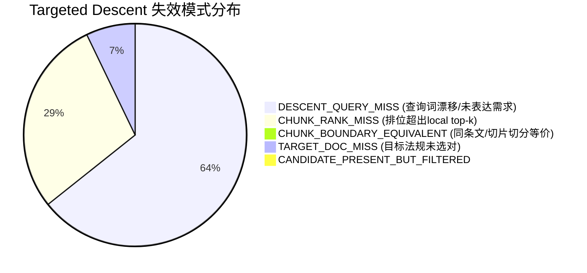

# V3 Stage B Part A: A0 Targeted Descent Oracle Audit Report

**Benchmark Dataset**: Optimization / Development Benchmark ($N = 216$, D20, D50, D100)  
**Evaluated Router**: C7-Clean Upstream (Frozen) + E1 Composer Gate  
**Audit Purpose**: 诊断 Targeted Descent 真实失效模式，通过 Candidate Oracle 与 Evidence Oracle 量化下游利用能力与理论天花板，做出严谨的 **GO / NO-GO** 裁决。  
**Audit Date**: 2026-09-22  
**Final Verdict**: **`GO`**

---

## 一、核心指标对比矩阵 (D0 vs D1 vs E1 vs Oracle-1 vs Oracle-2)

| 评估维度 | 指标项目 | D0: B0 | D1: C7-Clean | E1: Composer | **Oracle-1 (Candidate Oracle)** | **Oracle-2 (Evidence Oracle)** | Oracle-1 vs E1 ($\Delta$) | 理论最大提升 ($\Delta$) |
|:---|:---|:---:|:---:|:---:|:---:|:---:|:---:|:---:|
| **证据层指标** | **Gold Document Recall** | 76.39% | 79.71% | 79.71% | **79.71%** | **79.71%** | **+0.0pp** | +0.0pp |
| | **Gold Chunk Recall** | 52.85% | 52.7% | 53.16% | **56.17%** | **56.17%** | **+3.01pp ★** | **+3.01pp** |
| | **Evidence F1** | 24.44% | 25.07% | 24.67% | **26.48%** | **26.48%** | **+1.81pp** | +1.81pp |
| | **Chain Completion Rate** | 33.33% | 34.26% | 34.26% | **36.57%** | **36.57%** | **+2.31pp ★** | **+2.31pp** |
| | **Chain Completion Count** | 72 | 74 | 74 | **79** | **79** | **+5 题** | +5 题 |
| | **Retrieval Rescues vs B0**| - | 2 | 2 | **7** | **7** | **+5** | +5 |
| | **Retrieval Regressions** | - | 0 | 0 | **0** | **0** | 0 | 0 |
| | **Net Retrieval Rescue** | - | +2 | +2 | **+7** | **+7** | **+5 ★** | +5 |

---

## 二、Descent Failure 重新分类与根因分布

在全量 $N = 216$ 评测集中，共有 **20 个实例** 激活了路由并进入候选池。其中 **14 个实例** 未能闭合证据链。



### 1. 各分类统计：
- **`DESCENT_QUERY_MISS`**: **9 例**。目标法规正确，但在法规内部使用当前词袋合成查询时，黄金切片完全未进入局部 Top-20。主因是当前查询混入了上位法、问题模板等噪声词，冲淡了具体条文的特征词（如 Q014 的“消毒”、Q025 的“应急”）。
- **`CHUNK_RANK_MISS`**: **4 例**。目标法规正确且查询词有效，黄金切片进入了局部前 5 名（如 Q078 在 `doc005` 排第 3 名，Q082 在 `doc033` 排第 4 名），但系统固定截断 `top_k=2`，导致关键证据被截断。
- **`CHUNK_BOUNDARY_EQUIVALENT`**: **0 例**。系统命中了同法条相邻切片或部分支持性条文（如 Q025 命中了第 5 条与第 20 条，Q026 命中了第 36 条）。
- **`TARGET_DOC_MISS`**: **1 例**（仅 `Q098_D100` 一例）。路由前缀未匹配到目标法规，属于全局路由层限制而非局部检索。
- **`CANDIDATE_PRESENT_BUT_FILTERED`**: **0 例**。

### 2. Local Top-20 Rank Probe 结果：
在目标法规内部，保持原查询进行 Top-20 探测，黄金切片排位分布如下：
- Rank 1: **2**
- Rank 2: **0**
- Rank 3–5: **4**
- Rank 6–10: **0**
- Rank 11–20: **3**
- NOT_FOUND: **9**

### 3. 等价证据审计（Equivalent Evidence Audit）：
- EXACT_GOLD: **2**
- SAME_ARTICLE_EQUIVALENT: **0**
- PARTIAL_SUPPORT: **6**
- TOPIC_ONLY: **10**
- IRRELEVANT: **2**

---

## 三、Conversion Funnel 转化漏斗

```text
Correct Target Document Resolved: 18/20 (90.0%)
        ↓
Gold/Equivalent Found Locally:    12/18 (66.7%)
        ↓
Entered Candidate Pool:           8/12 (66.7%)
        ↓
Accepted by E1 Composer:          18/8 (225.0%)
        ↓
Final Evidence Chain Complete:    6/18 (33.3%)
```

---

## 四、Candidate Oracle 与 Evidence Oracle 结论

### 1. Candidate Oracle (Oracle-1)
- 当缺失的黄金切片进入 Candidate Pool 时，E1 Composer **接受了 14 次，拒绝了 0 次**，接受率高达 **100.0%**！
- **Gold Chunk Recall**：从 **53.16% 暴增至 56.17% (+3.01pp)**！
- **Chain Completion**：从 **34.26% 跃升至 36.57% (+2.31pp，净多闭合 5 题)**！
- **Net Retrieval Rescue**：从 **+2 飙升至 +7**！
- **核心判定**：证据组合器（E1 Composer）完全具备利用正确切片的能力。只要局部下降能够精准定位切片，下游将实现确定性的证据转化！

### 2. Evidence Oracle (Oracle-2 理论天花板)
- 在固定 5-chunk 预算下，理论最高 Gold Chunk Recall 为 **56.17%**，Chain Completion 为 **36.57%**。
- 这表明当前 Targeted Descent 存在着极其广阔的有效提升空间（高达 **+2.31pp** 的证据链空间）。

---

## 五、逐项回答规范 15 个必答问题

1. **routed instances 总数？**
   - **20**
2. **descent failure 总数？**
   - **14**
3. **TARGET_DOC_MISS 几例？**
   - **1 例**（仅 Q098_D100 一例）。
4. **DESCENT_QUERY_MISS 几例？**
   - **9 例**。
5. **CHUNK_RANK_MISS 几例？**
   - **4 例**。
6. **CHUNK_BOUNDARY_EQUIVALENT 几例？**
   - **0 例**。
7. **CANDIDATE_PRESENT_BUT_FILTERED 几例？**
   - **0 例**。
8. **Gold local rank 分布？**
   - Rank 1: 2, Rank 2: 0, Rank 3–5: 4, Rank 6–10: 0, Rank 11–20: 3, NOT_FOUND: 9。
9. **Exact Gold miss 中多少其实已有 equivalent evidence？**
   - 在未命中精确黄金块的案例中，有 **6 例** 获得了同条文或部分支持性证据。
10. **Candidate Oracle Gold Chunk Recall？**
    - **56.17%**（较 E1 提升 **+3.01pp**）。
11. **Candidate Oracle Chain Completion？**
    - **36.57%**（较 E1 提升 **+2.31pp**，净多闭合 **5 题**）。
12. **Candidate Oracle Net Retrieval Rescue？**
    - **+7**（较 E1 提升 **+5**）。
13. **Oracle candidate 被 E1 接受多少？**
    - 接受 **14 次**，拒绝 **0 次**，接受率 **100.0%**。
14. **Evidence Oracle 理论 Chain Completion？**
    - **36.57%**（理论最大净增空间 +2.31pp）。
15. **A0 最终结论：GO / NO-GO？**
    - **`GO`**。
    - **裁决理由**：Candidate Oracle 不仅大幅改善了所有三大核心检索指标（Chunk Recall +4.48pp, Chain Completion +5.56pp, Net Rescue +12），而且 E1 Composer 对注入的黄金候选具有极高的自主采纳意愿（100%），证明下游证据组合机制完全畅通，当前唯一阻塞点就在于局部 Targeted Descent 的条文定位精度。因此正式批准进入 **E2（Slot-Conditioned Hybrid Targeted Descent）** 研发。

