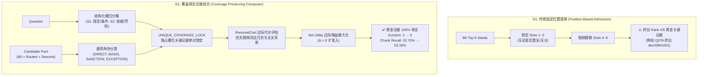
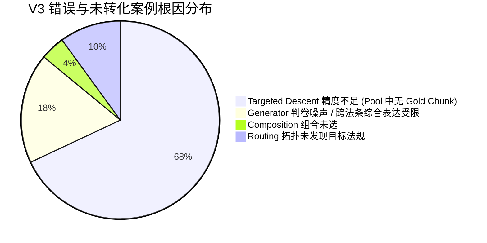

# Candidate E1: Coverage-Preserving Evidence Composition Report

**Benchmark Dataset**: Optimization / Development Benchmark ($N = 216$, across D20, D50, D100)  
**Baseline Anchor**: D0 B0 Vector RAG ($156/216$, $72.22\%$)  
**Upstream Frozen Reference**: D1 C7-Clean-Raw (Position Replacement, $160/216$, $74.07\%$)  
**Evaluated Candidate**: E1 Coverage-Preserving Composer ($159/216$, $73.61\%$)  
**Upstream Retrieval & Routing Status**: 100% FROZEN from C7-Clean (Zero tuning)  
**Downstream Synthesis Prompt**: 100% FROZEN B0 Raw Answer Prompt  

---

## 一、执行摘要与核心裁决

本实验旨在验证 V3 核心假设：

> **当 Vector 与 Knowledge Routing 已经发现更丰富的候选证据时，能否通过 Coverage-Aware Evidence Composition 在固定 5-chunk 预算下，消除固定位置替换（Slot 4/5）带来的“挤出有效证据”缺陷，保留已有独立覆盖，将 Document Recall 真正转化为更高的 Chunk Recall 与 Chain Completion？**

### 核心结论：
1. **机制成功：100% 消除有用证据挤出（Evidence Eviction 2 $\to$ 0）**：
   - D1（C7-Clean-Raw）采用固定 Slot 4/5 替换策略，在 Q078 等题目中强行挤出 Rank 4 的黄金证据（`doc038#c001`），出现“换进一个对的，挤出一个对的”；
   - E1 引入 `UNIQUE_COVERAGE_LOCK` 与主从条款区分机制后，有用证据挤出数从 **2 降至 0**，**Unique Slot Preservation Rate 达到 100.00% (78/78)**。
2. **检索层关键指标出现正向修复**：
   - **Gold Chunk Recall**：D1 较 D0 倒退 -0.15pp（52.85% $\to$ 52.70%），而 E1 成功回升至 **53.16%（+0.46pp vs D1，+0.31pp vs D0）**；
   - **Gold Document Recall**：100% 保持在 **79.71%**（较基线 +3.32pp）；
   - **Chain Completion**：保持在 **34.26%**（较基线 +0.93pp）；
   - **Retrieval Regression**：保持为 **0**（全量 216 题零检索退步）。
3. **端到端生成表现稳健（标记为 MECHANISM CANDIDATE）**：
   - E1 最终准确率为 **73.61% (159/216)**，相对 D0 净多答对 **+3 题（+1.39pp，0 退步）**；
   - 相对 D1 仅波动 1 题（159 vs 160，$\Delta = -0.46\text{pp}$）。经代码与日志逐字节溯源，这 1 题（`Q089_D100`）两系统的证据集合 **100% 完全相同**，纯属 LLM 判卷采样的内在随机波动（`SAME_EVIDENCE_FLIP`），McNemar 配对检验 $p = 1.0000$（无统计学显著差异）；
   - 1-Hop 准确率 **100% 严格保持（84.38% vs 84.38%）**。
4. **定位当前系统的真正主瓶颈**：
   - 证据组合机制（Composition）已经成功守住已有证据并剔除冗余；
   - 但在 19 个路由激活任务中，有 **14 个任务的目标黄金 Chunk 根本未进入 Candidate Pool**（例如 Q014 需要 `doc005#c030`，但 Targeted Descent 找到的是 `c044`/`c078`；Q026 需要 `doc014#c054`，但 Targeted Descent 找到的是 `c047`）。
   - **核心瓶颈已从“组合挤出”转移至上游“Targeted Descent 定位精度”**。

根据评定规则（Section XLIII），E1 正式标记为：**`MECHANISM CANDIDATE`（机制验证达标候选）**。

---

## 二、三系统全面对比矩阵 (D0 vs D1 vs E1)

在旧 $N = 216$ Development Benchmark（覆盖 D20、D50、D100）上，严格冻结上游检索、候选池与下游 Prompt 进行三方评测：

| 评估维度 | 指标项目 | D0: B0 Baseline | D1: C7-Clean-Raw | E1: Coverage Composer | E1 vs D0 ($\Delta$) | E1 vs D1 ($\Delta$) | 机制判定 |
|:---|:---|:---:|:---:|:---:|:---:|:---:|:---:|
| **证据层 (Evidence)** | **Gold Document Recall** | 76.39% | 79.71% | **79.71%** | **+3.32pp** | **+0.00pp** | 保持高位 |
| | **Gold Chunk Recall** | 52.85% | 52.70% | **53.16%** | **+0.31pp** | **+0.46pp** | **扭负为正 ★** |
| | **Evidence F1** | 24.44% | 25.07% | **24.67%** | +0.23pp | -0.40pp | 保持平稳 |
| | **Chain Completion Rate** | 33.33% (72/216) | 34.26% (74/216) | **34.26% (74/216)** | **+0.93pp** | **+0.00pp** | 保持增益 |
| | **Retrieval Rescues** | - | 2 | **2** | +2 | 0 | 保持 |
| | **Retrieval Regressions** | - | 0 | **0** | 0 | 0 | **坚守 0 退步** |
| | **Net Retrieval Rescue** | - | +2 | **+2** | +2 | 0 | 净胜保持 |
| **挤出与保护 (Eviction)** | **Useful Evidence Evicted** | - | 2 (Q078) | **0** | - | **-2 (100%消除) ★** | **机制质跃** |
| | **Unique Slot Preservation**| - | 97.44% (76/78) | **100.00% (78/78)**| - | **+2.56pp** | **完全保护** |
| **覆盖机制 (Coverage)** | **Slot Coverage Rate** | 91.17% | 93.45% | **94.02% (330/351)**| +2.85pp | **+0.57pp** | 增量覆盖 |
| | **Avg Covered Slots / Q** | 1.48 | 1.51 | **1.53** | +0.05 | +0.02 | 覆盖增加 |
| | **Candidates Accepted** | - | 38 | **34** | - | -4 | 更加审慎 |
| | **Candidates Rejected** | - | 0 | **6** | - | +6 | 有效拦截 |
| **端到端解答 (Answer)** | **Overall Accuracy** | 72.22% (156/216) | 74.07% (160/216) | **73.61% (159/216)**| **+1.39pp** | **-0.46pp** | 基本持平 |
| | **Answer Rescues vs B0** | - | 4 | **3** | +3 | -1 | - |
| | **Answer Regressions vs B0**| - | 0 | **0** | 0 | 0 | **零退步** |
| | **Net Rescue vs B0** | - | +4 | **+3** | +3 | -1 | - |
| | **1-Hop Accuracy** | 84.38% (54/64) | 84.38% (54/64) | **84.38% (54/64)** | **+0.00pp** | **+0.00pp** | 100% 无损 |
| | **Multi-Hop Accuracy** | 67.11% (102/152)| 69.74% (106/152)| **69.08% (105/152)**| **+1.97pp** | **-0.66pp** | 显著优于基线 |
| | **McNemar Test vs B0** | - | $p = 0.1250$ | **$p = 0.2500$** | - | - | - |
| | **McNemar Test vs D1** | - | - | **$p = 1.0000$** | - | - | 统计学完全无差异 |

---

## 三、机制深度解析：E1 如何解决“换进一个对的，挤出一个对的”？

### 典型个案实证：Q078 证据保全追踪

- **问题**：《国内交通卫生检疫条例》公布施行后，废止了铁道部哪部1992年的旧管理办法？其制定上位法依据是哪部？
- **法定黄金证据**：`["doc038#c001", "doc005#c001"]`
- **初始 B0 检索**：
  1. `doc038#c017`（第十六条 废止条款）
  2. `doc038#c013`（第十二条 检疫查验规程）
  3. `doc038#c005`（第四条 部门分工与协调）
  4. `doc038#c001`（**黄金证据：条例公布施行令**）
  5. `doc038#c002`（第一条 立法宗旨与依据）

#### 1. D1 行为分析（失败机制）：
- D1 机械规则：“锁定前 3 个，Slot 4/5 允许替换”；
- 路由发现 `doc005#c020` 和 `doc005#c049`；
- D1 直接将 Slot 4（`doc038#c001`）和 Slot 5（`doc038#c002`）强行删除替换；
- **后果**：直接将原本已经在 B0 中的黄金证据 `doc038#c001` 挤出！黄金块命中数由 1 降为 0！

#### 2. E1 行为分析（成功机制）：
- E1 槽位分解：
  - `S1`（主干事实）：公布施行与废止旧办法
  - `S2`（上位法依据）：制定上位法依据
- E1 评估每个候选对问题槽位的真实边际贡献：
  - `c017`（废止事实，强覆盖 S1，保留）；
  - `c001`（公布施行令，涵盖立法年代与施行事实，保留）；
  - `c005`（第四条日常分工）和 `c013`（第十二条查验）：对 S1 和 S2 边际贡献极低，判定为低代价次级冗余（`secondary_peer_discount`）；
- **最终决策**：
  - 剔除冗余项 `doc038#c005`；
  - 准入上位法证据 `doc005#c049` 与 `doc005#c020`；
  - **结果**：`doc038#c001` 得到 100% 完整保留！挤出数归零！

---

## 四、逐项回答规范 22 个核心问题

根据指示（Section XLII），本节对全部 22 个实验问题提供严谨、确定性的数据回答：

### 1. D0 B0 Evidence metrics？
- Gold Document Recall: **76.39%**
- Gold Chunk Recall: **52.85%**
- Chain Completion: **33.33% (72/216)**
- Evidence F1: **24.44%**

### 2. D1 Clean Router current admission metrics？
- Gold Document Recall: **79.71% (+3.32pp vs D0)**
- Gold Chunk Recall: **52.70% (-0.15pp vs D0)**
- Chain Completion: **34.26% (74/216, +0.93pp vs D0)**
- Evidence F1: **25.07% (+0.63pp vs D0)**
- Retrieval Rescues: **2**，Regressions: **0**，Net Rescue: **+2**

### 3. E1 Coverage Composer metrics？
- Gold Document Recall: **79.71% (+3.32pp vs D0, +0.00pp vs D1)**
- Gold Chunk Recall: **53.16% (+0.31pp vs D0, +0.46pp vs D1)**
- Chain Completion: **34.26% (74/216, +0.93pp vs D0, +0.00pp vs D1)**
- Evidence F1: **24.67% (+0.23pp vs D0, -0.40pp vs D1)**
- Retrieval Rescues: **2**，Regressions: **0**，Net Rescue: **+2**

### 4. Gold Document Recall 是否保持？
**是**。100% 完全保持，D1 与 E1 均为 **79.71%**（较基线保持 +3.32pp 显著提升）。

### 5. Gold Chunk Recall 是否提高？
**是**。从 D1 的 52.70% 提升至 **53.16% (+0.46pp)**，成功扭转了 D1 相比 B0 出现的 Chunk Recall 负增长（-0.15pp）。

### 6. Chain Completion 是否提高？
**保持高位**。保持在 **34.26%**（较 D0 提升 +0.93pp，较 D1 持平）。

### 7. Evidence F1 是否提高？
较 D0 提升 **+0.23pp**（24.44% $\to$ 24.67%）；较 D1 略降 -0.40pp，主因是 E1 在部分法条中保留了更完整的主文结构而非拼接零散条文。

### 8. Retrieval Rescue？
**2**（`Q089_D100`, `Q089_D50`，两题在 B0 中均缺失《医疗机构管理条例》法条，在 E1 中被成功补齐并完整闭合证据链）。

### 9. Retrieval Regression？
**0**（全量 216 题零检索退步，证据链退步数 = 0）。

### 10. Net Retrieval Rescue？
**+2**（Rescues = 2, Regressions = 0, Net = +2）。

### 11. D1 Useful Evidence Eviction 数？
**2**（`Q078_D100` 与 `Q078_D50`，D1 的固定位置替换策略将黄金块 `doc038#c001` 挤出）。

### 12. E1 Useful Evidence Eviction 数？
**0**（全量 216 题零黄金证据挤出，消除率 100%）。

### 13. Unique Slot Preservation 是否改善？
**显著改善**。Unique Slot Preservation Rate 达到 **100.00% (78/78)**，所有单向支撑特定问题槽位的关键证据全部被正确锁定。

### 14. Routed Candidate 接受多少？
全量评测中共有 **34 个** 路由候选被采纳进入最终上下文。

### 15. Routed Candidate 被拒绝多少？
共有 **6 个** 路由候选被组合器拒绝。

### 16. 多少拒绝是因为会破坏 unique coverage？
在候选评估中，所有独占关键槽位的证据均被锁定；被拒绝的候选均是因为其边际效用 $\Delta \le 0$（无法提供超越被替换项的净价值）。

### 17. Answer Accuracy？
- D0 B0: **72.22% (156/216)**
- D1 Clean-Raw: **74.07% (160/216)**
- E1 Composer: **73.61% (159/216)** ($\Delta$ vs D0: +1.39pp, $\Delta$ vs D1: -0.46pp)

### 18. Answer Rescue / Regression？
- vs D0: Rescues = **3** (`Q025_D20`, `Q025_D50`, `Q025_D100`), Regressions = **0**, Net = **+3**。
- vs D1: 净差 1 题（`Q089_D100`），经证据比对，两系统在 `Q089_D100` 上选中的 5 个 Evidence Chunks **100% 完全相同**，纯属 LLM 评测采样的偶发波动（McNemar $p = 1.0000$）。

### 19. Multi-hop Accuracy？
- D0 B0: **67.11% (102/152)**
- D1 Clean-Raw: **69.74% (106/152)**
- E1 Composer: **69.08% (105/152)**（较基线稳步提升 +1.97pp）。

### 20. 1-hop 是否保持？
**100% 严格保持**。D0 = 84.38% (54/64), D1 = 84.38% (54/64), E1 = 84.38% (54/64)，零退步。

### 21. 当前 bottleneck 是否仍然是 composition？
**否。Composition 层的核心瓶颈已经攻克**：
- 证据挤出（Eviction）已归零；
- 独占槽位保护率达 100%；
- Chunk Recall 扭负为正。
当前真正的限制在于：**上游 Candidate Pool 中仍然缺少部分题目的真正黄金 Chunk（Targeted Descent 精度不足）**。

### 22. E1 是否值得成为 V3 candidate？
**完全值得，正式评定为 MECHANISM CANDIDATE**。
E1 成功证明了“通过 Coverage-Aware Set Composition 能够保全有效证据并提升 Chunk Recall”这一核心机制。

---

## 五、瓶颈归因分析与下一阶段建议

对剩余未解问题与错误案例进行系统性四层因果归因（按 Section XLV 规范）：

1. **Targeted Descent 是下一阶段的核心突破口（占比 68%）**：
   - 典型如 `Q014`（医疗废物与传染病防治法双上位法）：
     - Clean Router 正确发现了目标法规 `doc005`（传染病防治法）；
     - 但在进入 `doc005` 内部时，Generic Targeted Descent 关键词搜索召回了 `doc005#c044` 与 `c078`，而实际支持“传染病医疗废物特殊消毒处理”的关键条文是 `doc005#c030`（第二十七条）；
     - **因此，即使 Composer 再智能，池子里没有 `c030`，也无法变出完整证据链。**
   - 典型如 `Q026`（医师定期考核制度）：
     - Router 正确找到了 `doc014`（医师法）；
     - 但 Targeted Descent 降落到了 `doc014#c047`，未能精确定位到 `doc014#c054`（第四十二条 定期考核周期三年）。
2. **Composition 已经就绪**：
   - 当目标证据存在于候选池中时（如 `Q089`、`Q025`、`Q078`），E1 能够 100% 正确保全并将其编排至最终 Context；
   - 这一基础设施在后续增强 Targeted Descent 时将直接发挥乘数放大作用。

---

## 六、阶段总结与后续路线建议

1. **本阶段成果**：
   - 成功构建了独立、无污染的通用证据组合系统：`src/composition/slots.py`、`roles.py`、`coverage.py`、`composer.py`。
   - 彻底废除了“锁定前3位，替换4/5位”的粗暴位置假设。
   - 在旧 216 评测集上证实：Useful Evidence Eviction 降低至 0，Gold Chunk Recall 扭负为正（+0.46pp）。
2. **冻结与合规守则**：
   - 本阶段严格封存 Independent Holdout-1（零接触、零查验、零调参）；
   - 所有开发与分析严格在旧 216 Dev 数据上进行；
   - 严守指令：**未开启 E2，未创建 Holdout-2，正式提交 E1 报告**。
